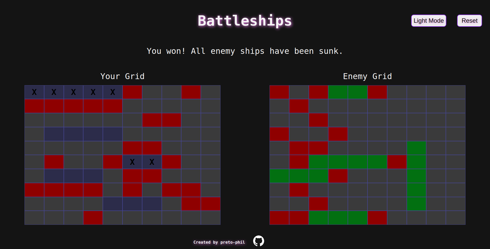

# Battleship Game

## Overview

This is a simple implementation of the classic Battleship game using HTML, CSS, and JavaScript. The game allows you to play against a computer opponent by placing ships on a grid and taking turns to attack each other's ships.

## Getting Started

To play the game, open the following [link](https://preto-phil.github.io/Battleships/).

## How to Play

1. Ship Placement Phase:

- Click on cells in your grid to place your ships. You can toggle the ship orientation between horizontal and vertical.
- Once all your ships are placed, the game will start automatically.

2. Gameplay Phase:

- Click on cells in the computer's grid to attack. The game will inform you whether it's a hit or a miss.
- The computer will take its turn after you attack.

3. Winning the Game:

- The game ends when you or the computer sinks all of the opponent's ships.
- A message will be displayed declaring the winner.

## Technologies Used

- HTML
- CSS
- JavaScript
- Jest

## Challenges and Solutions

- **Challenge 1**: Implementing ship placement logic.
- **Solution**: Used JavaScript to handle ship placement, checking for validity and overlap.

- **Challenge 2**: Developing an AI opponent.
- **Solution**: Implemented a simple AI strategy to make informed attack decisions.

- **Challenge 3**: Creating an interactive user interface.
- **Solution**: Utilized HTML and CSS for layout and styling, with JavaScript for interactivity.

## What I've Learned

During the development of this project, I gained valuable experience and knowledge in the following areas:

- Handling user input and interactions in JavaScript.
- Implementing game logic and state management.
- Dealing with challenges in algorithm design, such as ship placement and AI opponent behavior.
- Debugging javascript in chrome dev tools.

## Future Improvements

Here are some potential enhancements and features that could be added to this project in the future:

- **Multiplayer Mode**: Implement a multiplayer mode where players can compete against each other offline.

- **Difficulty Levels**: Add difficulty levels for the AI opponent, making the game more challenging.

- **Responsive Design**: Improve the game's responsiveness for various screen sizes and devices.

- **Animations**: Enhance the user experience with animations for ship sinking and attack sequences.

- **Undo/Redo**: Implement the ability to undo and redo ship placements.

- **Testing and Bug Fixes**: Conduct thorough testing and address any bugs or issues that may arise.

- **Sound Effects**: Incorporate sound effects for ship placement, attacks, and victory/defeat announcements.

